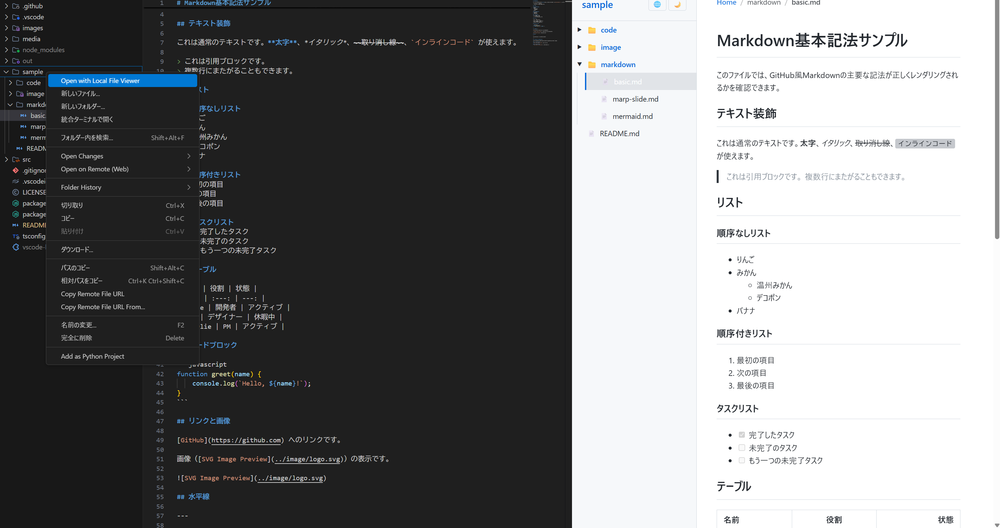
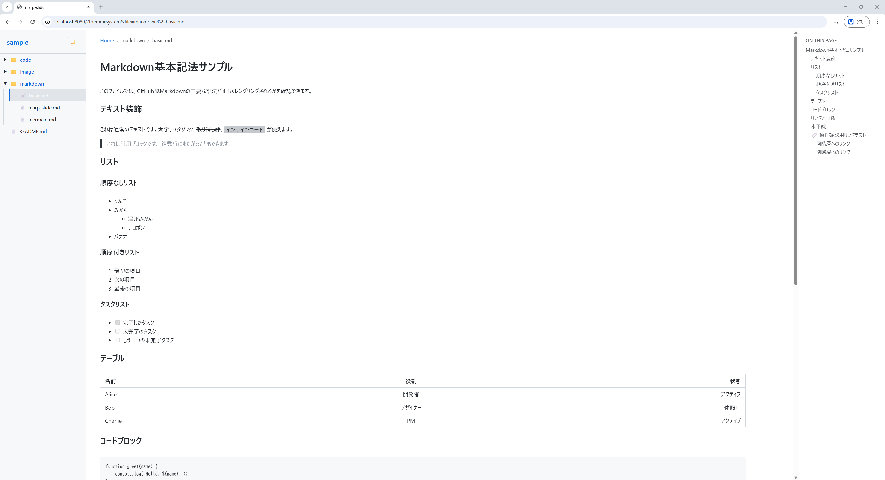
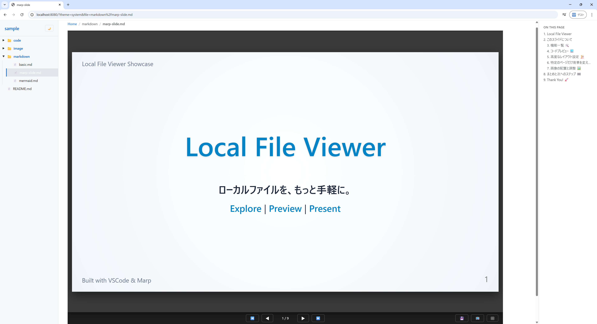

# Local File Viewer

Markdownや様々なローカルファイルを、リッチなプレビュー画面で閲覧できるVSCode拡張機能です。
以下の特徴的なハイブリッド構成を持っています。

1.  **VSCode内蔵サーバー**: 拡張機能の中に軽量なWebサーバーを内蔵しています。
2.  **ブラウザ互換**: VSCode内だけでなく、Chromeなどのブラウザでも全く同じ画面でファイルを閲覧できます。

## 機能
- **ローカルファイルのツリー表示機能**
- **GitHubスタイルのMarkdownプレビュー**
- **Marpスライドプレビュー**（`marp: true` を自動検知）
- **Mermaidダイアグラムの表示**

## スクリーンショット

### VSCode プレビュー
<a href="./images/vscode_preview.png"></a>

### ブラウザ プレビュー
<a href="./images/browser_preview.png"></a>

### Marp スライド表示
<a href="./images/marp_preview.png"></a>

## インストール

`.vsix` ファイルから以下のいずれかの方法でインストールできます。

**方法1: コマンドラインから**
```bash
code --install-extension vscode-localfile-viewer-x.x.x.vsix
```

**方法2: VSCodeのGUIから**
1. サイドバーの拡張機能アイコン（`Ctrl+Shift+X`）を開く
2. 右上の `...` メニューから **「VSIXからのインストール...」** を選択
3. `.vsix` ファイルを選択

**方法3: エクスプローラーから**
1. `.vsix` ファイルをVSCodeのエクスプローラーで表示されるフォルダに配置
2. ファイルを **右クリック** → **「Install Extension VSIX」** を選択

## 使い方
1.  VSCodeのエクスプローラーで、見たいフォルダを **右クリック** します。
2.  メニューから **"Open with Local File Viewer"** を選択します。
3.  新しいタブでビューアが開きます。
    - 左側のリストからファイルを選択して閲覧できます。
    - 右下に通知される「Open in Browser」ボタンを押すと、ブラウザで同じ画面が開きます。

## 設定

以下の設定項目があります（`settings.json` または設定画面で変更可能）。

*   `localFileViewer.serverPort`: 内蔵サーバーのポート番号（デフォルト: `8080`）
    *   指定したポートが使用中の場合、自動的に次の空きポート（8081, 8082...）を探して起動します。
    *   `0` を指定すると、毎回ランダムなポートを使用します。
*   `localFileViewer.defaultTheme`: 既定のテーマ（デフォルト: `system`）
    *   選択肢: `light`, `dark`, `system`
    *   ※画面内のトグルボタンで変更した場合は、そちらの保存設定が優先されます。
*   `localFileViewer.autoOpenBrowser`: 起動時に自動的にブラウザを開くかどうか（デフォルト: `false`）
*   `localFileViewer.fileGroups`: デフォルトのグループ設定に追加したい拡張子を定義します。
    *   例: 既存の `code` グループに `.rs` を追加したい場合、以下のように設定します（既存の設定をコピーする必要はありません）。
        ```json
        "localFileViewer.fileGroups": {
            "code": [".rs"]
        }
        ```
    *   デフォルト定義（Markdown, 画像, 動画, 主要なプログラム言語）は自動的に適用されます。

    **デフォルトの対応拡張子一覧（代表例）:**
    | グループ | 拡張子 |
    | :--- | :--- |
    | **markdown** | `.md`, `.markdown` |
    | **image** | `.png`, `.jpg`, `.svg` など |
    | **media** | `.pdf`, `.mp4`, `.mp3` など |
    | **code** | `.js`, `.ts`, `.py`, `.sh`, `.json` など |

    全ての対応拡張子は [server.ts の DEFAULT_FILE_GROUPS](src/server.ts) を参照してください。

    **各グループの表示方法:**
    *   **markdown**: GitHub風のスタイルでレンダリング。Mermaidダイアグラム・Marpスライドにも対応。
    *   **image**: 画像として中央に表示。
    *   **media**: 動画・音声・PDFとして表示（ファイル形式に応じて自動判別）。
    *   **code**: シンタックスハイライト付きで表示。対応していない拡張子もテキストとして表示。

*   `localFileViewer.enabledGroups`: 各グループを表示するかどうかを切り替えます（`true`/`false`）。
    *   例: 画像を表示したくない場合は `"image": false` に設定します。

## ビルド

### 前提
*   Node.js（v16以上）
*   npm

### コマンド

```bash
# 依存パッケージのインストール
npm install

# .vsixファイルの作成
npx vsce package
```
