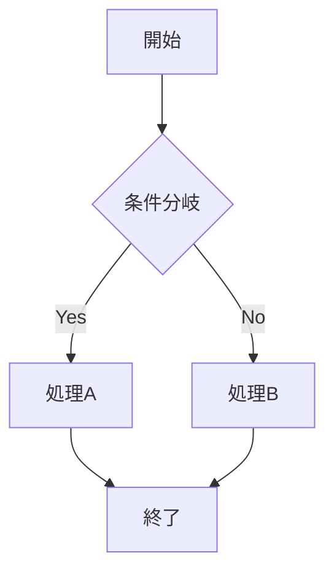
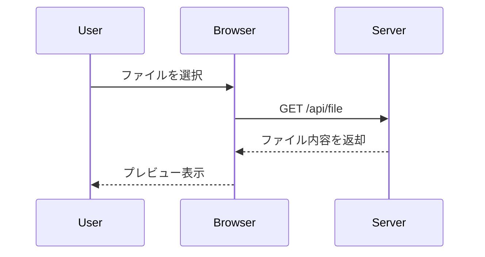
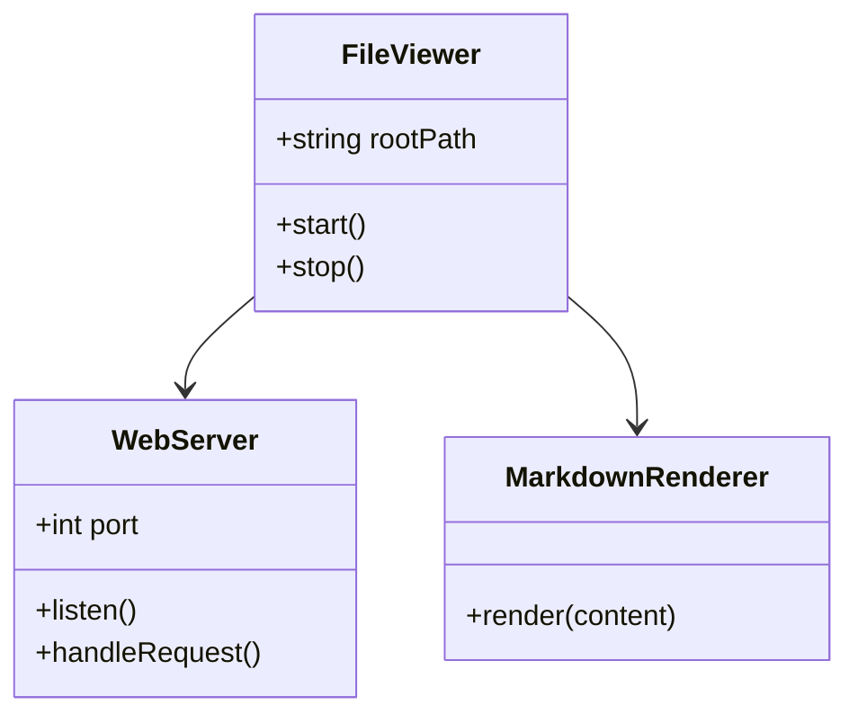
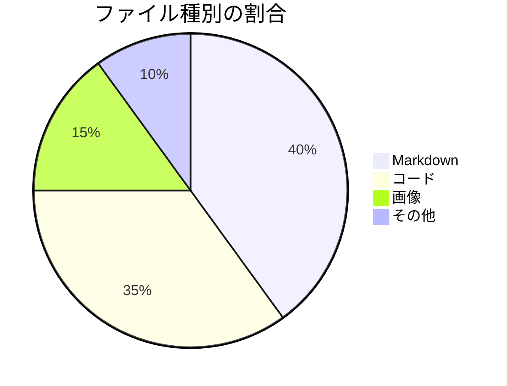

# Mermaidダイアグラム サンプル

Local File Viewer はMarkdown内の Mermaid記法を自動的にダイアグラムとして描画します。

## フローチャート

```mermaid
graph TD
    A[開始] --> B{条件分岐}
    B -->|Yes| C[処理A]
    B -->|No| D[処理B]
    C --> E[終了]
    D --> E
```

## シーケンス図

```mermaid
sequenceDiagram
    participant User
    participant Browser
    participant Server

    User->>Browser: ファイルを選択
    Browser->>Server: GET /api/file
    Server-->>Browser: ファイル内容を返却
    Browser-->>User: プレビュー表示
```

## クラス図

```mermaid
classDiagram
    class FileViewer {
        +string rootPath
        +start()
        +stop()
    }
    class WebServer {
        +int port
        +listen()
        +handleRequest()
    }
    class MarkdownRenderer {
        +render(content)
    }
    FileViewer --> WebServer
    FileViewer --> MarkdownRenderer
```

## パイチャート

```mermaid
pie title ファイル種別の割合
    "Markdown" : 40
    "コード" : 35
    "画像" : 15
    "その他" : 10
```
